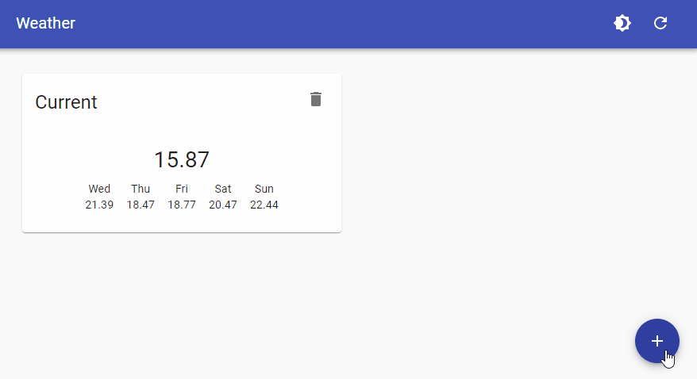
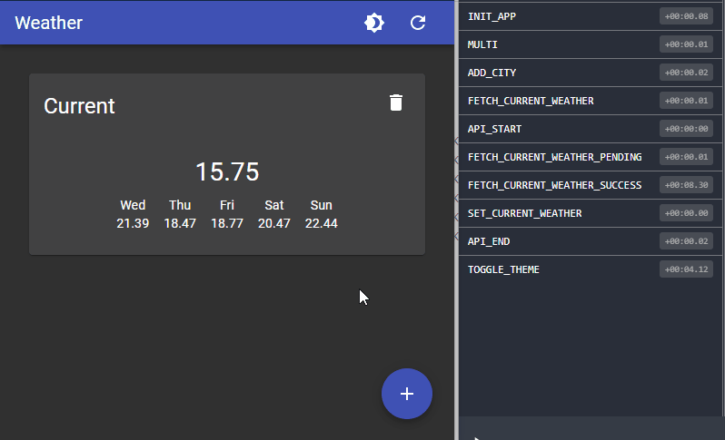

# Simple Weather App

A simple React - Redux - Typescript weather application.

## Features:
    - autosave cities in local storage
    - choose theme
    - responsive, works on mobile and desktop
    - extensive use of redux middleware to allow easy extension

## Demo
You can find a working demo [here](https://seastian.github.io/simple-weather-app/)

A little preview!

Open redux console to monitor events!

## How to install
Clone the repo. Install nodejs and run **npm install && npm run start**. Happy hacking!

